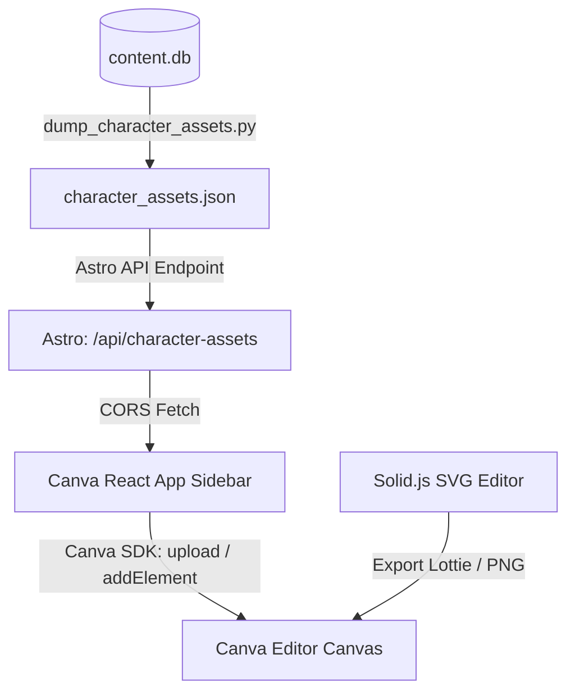

# Canva Stickman Animator Skill

This skill enables the orchestration and deployment of Canva-integrated stickman (Zollaman/Zollanyeo) video production apps and Solid.js custom SVG joint animators.

## Prerequisites

1. **Character Poses Database**: Ensure `channel/content.db` contains character pose PNG assets inside the `assets` table.
2. **Astro Backend Server**: Ensure the Astro server is running on `http://localhost:4321` so the Canva app can fetch assets dynamically via CORS.

## Commands & Workflows

### 1. Database Asset Synchronization
To dump the SQLite character assets (with name, description, local image file path) into JSON fallbacks and copy all files to `web/public` directory:
```bash
python scripts/dump_character_assets.py
```

### 2. Launching the Canva Side-panel App
To start the local developer server for the Canva App side-panel (serves on localhost:5173/5174 or config-defined port):
```bash
cd canva_apps_stickman
npm start
```
Once started, log in to the Canva Developer Portal and configure your app's frontend URL to the local dev server.

### 3. Launching the SVG Stickman Editor
To edit SVG stick figure keyframe animations frame-by-frame:
```bash
cd stickman_svg_editor
npm run dev
```

## Integration Flow


