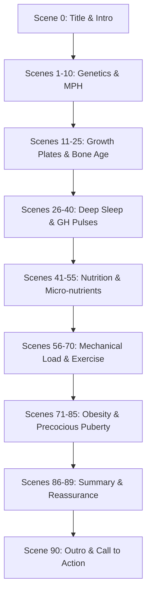

# Video Project Plan: The Science of Pediatric Growth and Height

> [!NOTE]
> This is a temporary planning document for the **child_growth_science** project. It outlines the visual and scientific framework of the 8-minute video before generating the full bilingual script.

---

## 1. Video Title Proposal
* **English Title:** How Tall Will Your Child Grow? The Science of Pediatric Growth and Height
* **Korean Title:** 우리 아이 키는 과연 몇 cm까지 자랄까? 소아 성장의 과학과 숨겨진 비밀
* **Sub-concept:** A warm, scientific, and empathy-driven exploration of human height, moving away from preachy clinical tones and focusing on supportive parent-child interactions.

---

## 2. Visual Guidelines (Prussia/Kindergarten TED-Ed Style)
To keep the tone warm and accessible, the visual narrative follows the benchmark style of TED-Ed animations with a child-friendly, crayon-drawn look.

* **Characters:**
  - **Parent Sprout:** A tall, slender green plant stem character with a couple of gentle leaves, expressive eyes, and a warm, nurturing posture.
  - **Child Sprout:** A tiny, delicate green sprout with two cute leaves, big curious eyes, and playful, energetic movements.
* **Art Style & Textures:**
  - High-texture crayon, pastel, and colored pencil drawings.
  - Visible sketch lines and paper textures to create a cozy, hand-made feel.
  - Minimalist flat illustrations with soft, organic edges.
* **Color Palette:**
  - Soft, single-tone pastel backgrounds that shift depending on the chapter mood (warm cream, soft mint, light lavender, cozy coral, pastel yellow).
* **Cinematography & Motion (Google Flow / Veo):**
  - **No static zoom-in only.** Use a rich variety of camera operations:
    - *Rotating slowly* to show different angles of growth.
    - *Zooming out (pull-away)* to reveal scale and comparison.
    - *Overhead angle (top-down)* for flat-lay scientific diagrams.
    - *Panning & tilting* to follow vertical growth.
  - **Watermark Avoidance:** Prompts must not request text, logos, or watermarks. The final video will use the Dolly Zoom-Crop technique (78% crop + Lanczos-4) and overlay the circular `assets/drjay_ed_logo_circle.png` logo scaled to 45x45 pixels in the bottom-right corner.

---

## 3. Compiled Empirical Science Data

### A. Parental Height Formula (Mid-Parental Height - MPH)
The genetic potential baseline is calculated using the standard pediatric formula:
* $$\text{Boys} = \frac{\text{Father's Height} + \text{Mother's Height} + 13\text{ cm}}{2}$$
* $$\text{Girls} = \frac{\text{Father's Height} + \text{Mother's Height} - 13\text{ cm}}{2}$$
* **Scientific Caveat:** MPH represents the statistical mean of genetic potential (around 70–80% of height variation). Epigenetics and environmental factors account for the remaining 20–30%, meaning a child can exceed or fall short of the MPH range.

### B. Bone Age & Skeletal Maturation
* **Growth Plates (Epiphyseal Plates):** Cartilage zones located at the ends of long bones. Chondrocytes (cartilage cells) multiply, stack, and eventually calcify (ossify) into solid bone, pushing the bone ends outward.
* **Skeletal Maturity Assessment:** Bone age is evaluated using a left hand/wrist X-ray. Pediatricians compare the maturation of carpal bones, metacarpals, and phalanges against standards like the **Greulich-Pyle Atlas** or the **Tanner-Whitehouse (TW3) method**.
* **Closure:** Post-puberty, systemic levels of estrogen and testosterone trigger the complete ossification of the epiphyseal plate. Once the plate is fully fused (replaced by the epiphyseal line), longitudinal growth stops.

### C. Sleep & Growth Hormone (GH) Secretion
* **Pulsatile Release:** Growth Hormone (somatotropin) is secreted by the anterior pituitary gland in pulsatile waves, not a steady stream.
* **Slow-Wave Sleep (N3 Stage):** Approximately 70–80% of daily GH secretion occurs during the deepest stages of non-REM sleep (Stage N3).
* **Timing & Quality:** The major GH pulse typically occurs 1 to 2 hours after falling asleep, coinciding with the first cycle of deep slow-wave sleep. Chronic sleep deprivation or blue-light-induced melatonin suppression prevents entering deep N3 sleep, severely reducing the peak GH pulse.

### D. Nutrition & Micro-nutrients
* **Calcium:** Serves as the structural mineral brick of the skeleton (hydroxyapatite).
* **Vitamin D:** Essential for intestinal calcium absorption. Without calcitriol (active Vitamin D), dietary calcium passes unabsorbed.
* **Zinc:** A critical cofactor for alkaline phosphatase, collagen synthesis, and DNA polymerase, promoting osteoblast activity and cell division in the growth plate.
* **Protein & Arginine:** Dietary proteins provide essential amino acids. In particular, L-Arginine acts as an endocrine trigger, stimulating the pituitary gland to secrete Growth Hormone.

### E. Exercise & Mechanical Loading
* **Chondrocyte Stimulation:** Moderate, dynamic mechanical stress (vertical loading, compression-decompression cycles) stimulates the proliferation of chondrocytes in the growth plates.
* **Vertical Exercises:** Skipping, jumping rope, and basketball create micro-impacts that trigger growth factors (like IGF-1) locally in the cartilage.
* **Posture & Stretching:** Relieves muscular tension and spinal compression, optimizing the biomechanical space for vertical growth.

### F. Obesity & Precocious Puberty Prevention
* **Adiposity & Leptin:** Excess body fat increases blood levels of **Leptin** (a hormone secreted by adipocytes).
* **The Neuroendocrine Axis:** 
  $$\text{Obesity} \rightarrow \uparrow \text{Leptin} \rightarrow \text{Hypothalamic Kisspeptin Activation} \rightarrow \uparrow \text{GnRH} \rightarrow \text{Precocious Puberty}$$
* **Early Plate Fusion:** GnRH stimulates the secretion of gonadotropins (LH and FSH), which trigger early release of sex hormones (especially estrogen in girls and testosterone/estrogen conversion in boys).
* **The Height Trap:** Estrogen accelerates bone maturation and triggers the rapid fusion of the growth plates. While obese children may experience a temporary height spurt early on, their growth period is cut short, reducing final adult height.

---

## 4. Script Structure: Scene 0 to Scene 90 (8-Minute Video)

### Outline of Scene Blocks

| Scene Range | Focus Area | Narration Goal | Key Visual Theme |
| :--- | :--- | :--- | :--- |
| **Scene 0** | **Title / Intro** | Hook the parents and introduce the plant sprout characters. | A tiny sprout standing next to a tall, warm parent sprout. |
| **Scene 1–10** | **Genetics & MPH** | Introduce the Mid-Parental Height (MPH) formula and explain genetic vs. environmental impact. | Interactive chalk board showing mathematical height calculations. |
| **Scene 11–25** | **Growth Plates & Bone Age** | Explain how bones grow. Define bone age, X-rays, and the epiphyseal cartilage. | Cute micro-scale view inside a sprout stem showing dividing cells. |
| **Scene 26–40** | **Sleep & GH** | Connect deep slow-wave sleep (N3) with growth hormone pulses. | Sprout child sleeping cozy under a leaf blanket while glowing bubbles rise. |
| **Scene 41–55** | **Nutrition** | Introduce Calcium, Vitamin D, Zinc, and Arginine. | Sprouts sorting healthy soil minerals (calcium bricks, sun vitamins). |
| **Scene 56–70** | **Exercise & Load** | Explain how jumping and stretching physically stimulate growth plates. | Sprout child joyfully jumping rope, stem stretching with elastic rings. |
| **Scene 71–85** | **Obesity & Puberty** | Detail the leptin-kisspeptin axis and how early estrogen shuts down growth. | Sprout becoming heavy, clock gears spinning fast, growth gate locking early. |
| **Scene 86–89** | **Summary** | Reassure parents and synthesize the actionable scientific steps. | Parent sprout hugging child sprout in a warm, sunny field. |
| **Scene 90** | **Outro** | Final brand signature and subscription call. | Brand logo `drjay-ed` overlay, subscription bell ringing. |

---

## 5. Next Steps
1. Write the detailed, bilingual (Korean/English) scene-by-scene script (`scenario.txt`) containing 91 scenes.
2. Formulate 91 precise image prompts and motion prompts matching the Prussia/Kindergarten TED-Ed style.
3. Delegate to Claude Code to run `autoveo_flow.py` for video generation and compilation.
